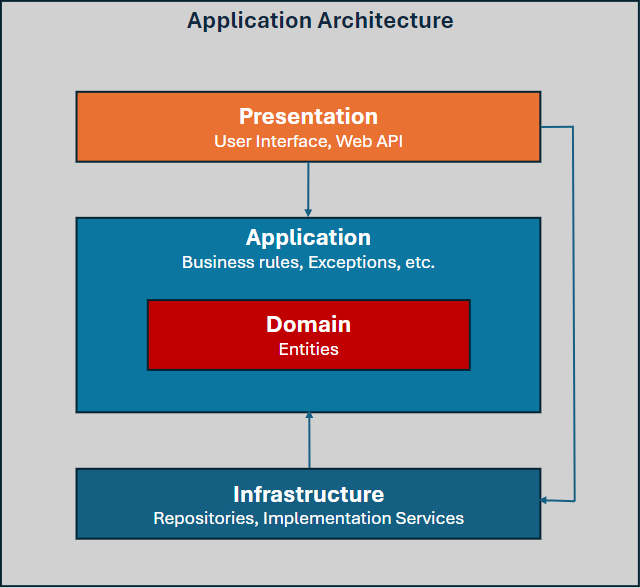
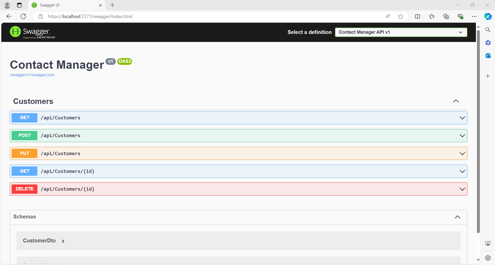

# Contact Manager
This project demonstrates a decoupled and maintainable design, with a repository pattern and Swagger UI for efficient API documentation and testing.

## Key Features
* **Clean Architecture**: Separation of concerns and decoupling of layers for maintainable and testable code
* **Repository Pattern**: Abstract data access layer for flexibility and reusability
* **Entity Framework Core**: Object-relational mapping for efficient database operations
* **Microsoft SQL Server**: Robust and scalable relational database management system
* **.NET 8**: Latest version of the .NET framework for improved performance and security
* **Swagger UI**: Interactive API documentation and testing tool


## Getting Started
1. **Clone the repository**: 
   ```bash
   git clone https://github.com/htayaung/workspace-webapps.git
2. ```bash
   cd workspace-webapps
   cd ContactManager
4. **Install dependencies**: dotnet restore
5. **Create a new database in SQL Express**:
    * Open SQL Server Management Studio (SSMS)
    * Connect to your local SQL Express instance
    * Create a new database named "ContactManager"
6. **Run the table creation scripts**:
    * Navigate to the Infrastructure/Scripts folder
    * Execute the scripts
7. **Update the connection string**: In the appsettings.json file, update the "DefaultConnection" string to point to your newly created database
8. **Run the application**: dotnet run
9. **Access Swagger UI**: https://localhost:7271/swagger/index.html


