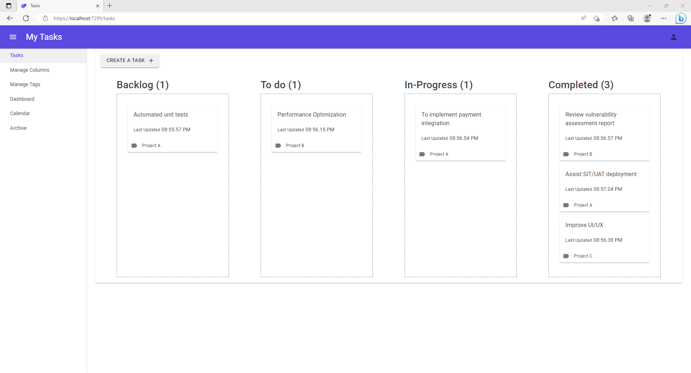
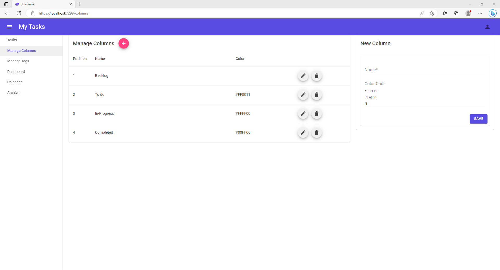
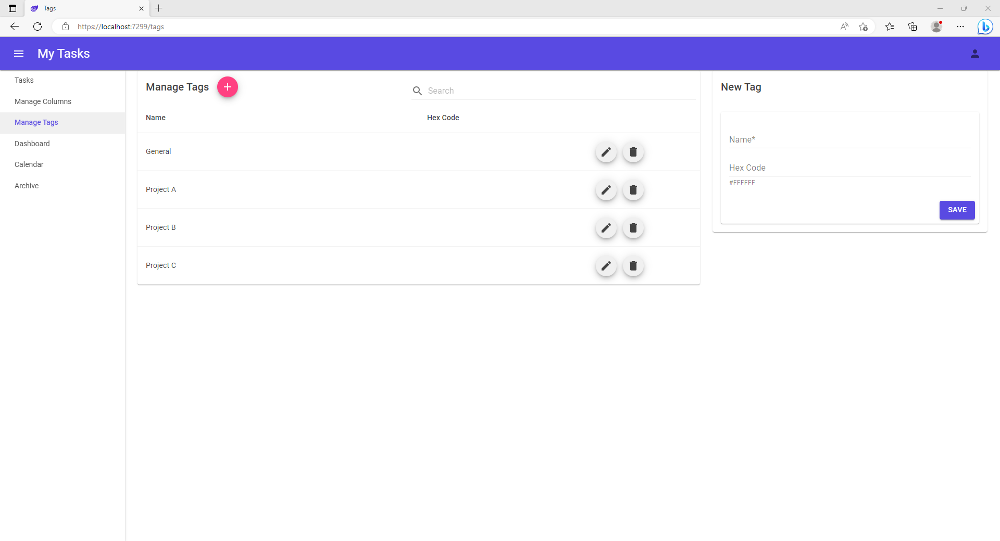
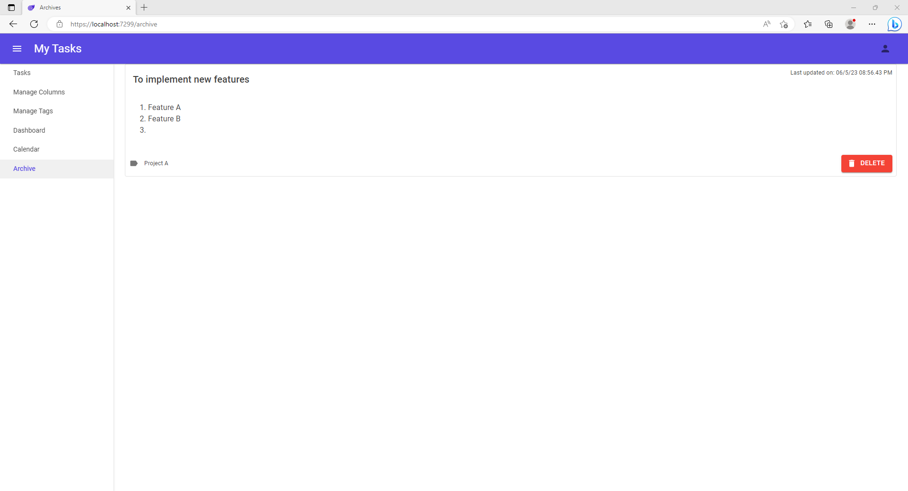
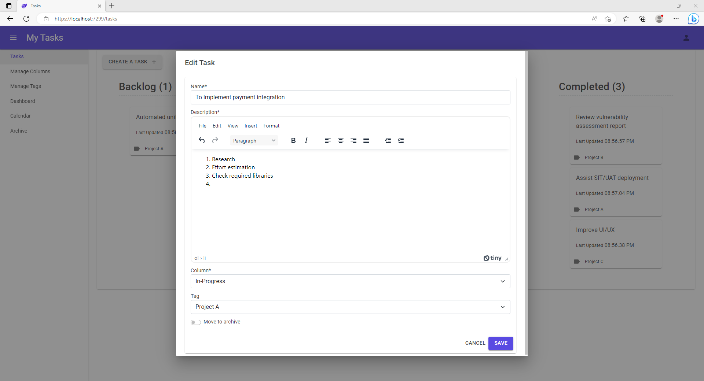

# MyTasks

## Background
A simple project to manage daily tasks.

This is a demo project using the following technologies.

## Technologies used
* C#
* .NET 7
* Blazor Server
* Entity Framework Core
* SQL Express
* Bootstrap
* [MudBlazor](https://mudblazor.com)
* TinyMCE.Blazor (for WYSIWYG editor)

## Screenshots

https://user-images.githubusercontent.com/13251420/236626902-360245c3-411b-407c-87c6-d21b1fa8aed8.mp4

  
  
  
  
  

## References
* https://dotnet.microsoft.com/en-us/apps/aspnet/web-apps/blazor
* https://chrissainty.com/investigating-drag-and-drop-with-blazor/
* https://mudblazor.com
* https://www.tiny.cloud/docs/integrations/blazor/
