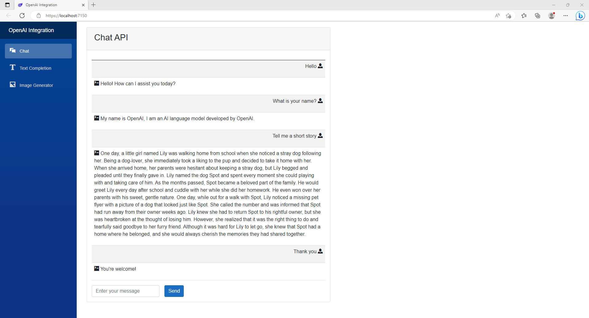
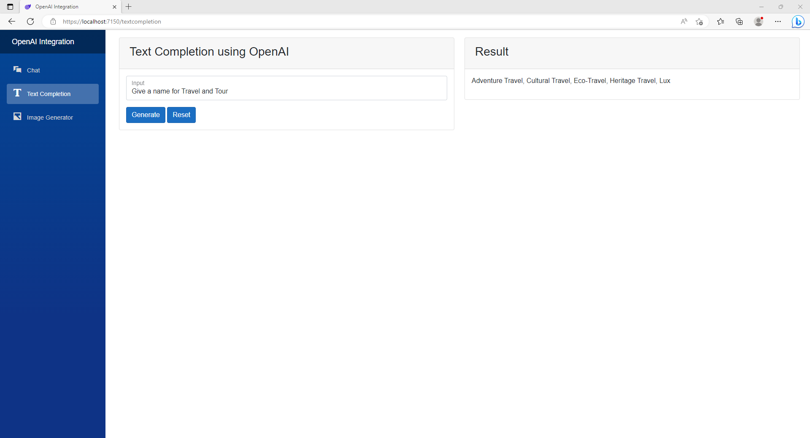
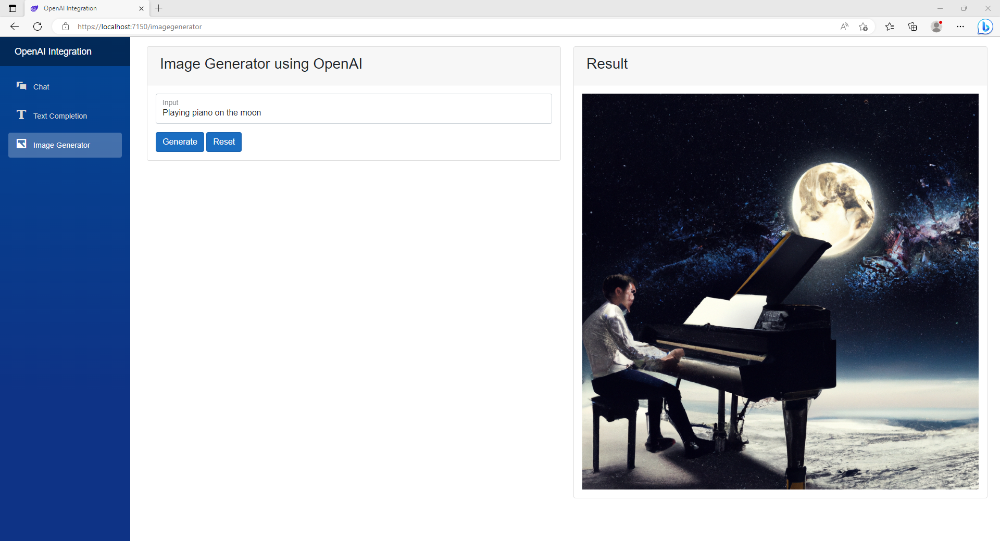

# A demo project using Open AI API in .NET application

## Technologies used
* C#
* .NET 7
* Blazor Server
* Bootstrap
* [OpenAI](https://github.com/OkGoDoIt/OpenAI-API-dotnet)

## Screenshots
https://user-images.githubusercontent.com/13251420/232319356-88794aa3-942f-46bb-bee8-55d417913cc8.mp4

 

  
  
  

