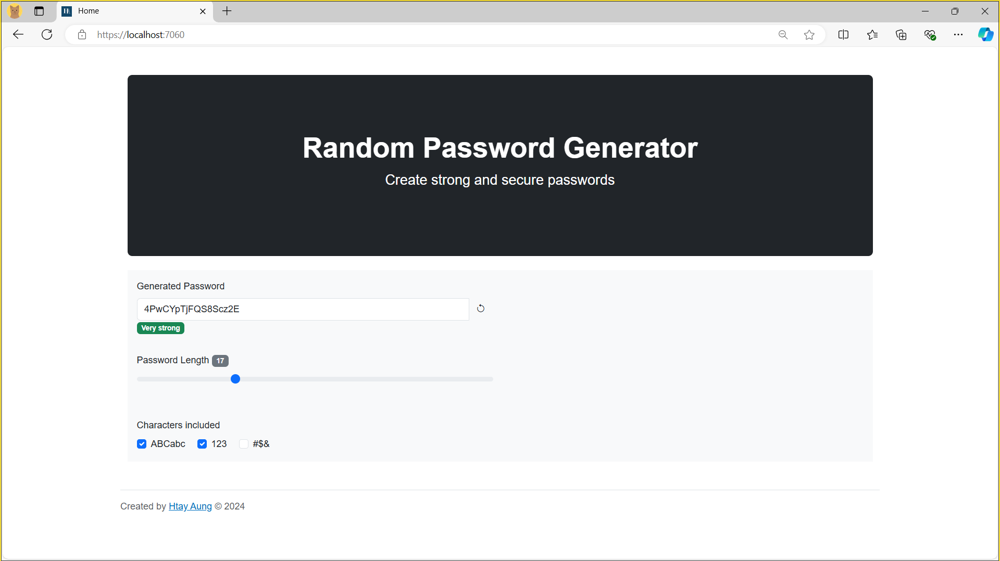

# RandomPasswordGenerator

A simple yet powerful web application built with .NET 7 and Blazor that generates secure, random passwords. Perfect for users looking to enhance their online security without the hassle of manual password creation.

## Features

* **Customizable Password Length**: Choose the length of your passwords.
* **Character Variety**: Select from upper case letters, lower case letters, numbers, and special characters.
* **User-Friendly Interface**: Intuitive Blazor front-end for seamless interaction.

## Technologies Used
* C#
* .NET 7
* Blazor

## Screenshots
https://github.com/user-attachments/assets/ea64e000-980f-4b25-a5ea-3d6e3e6dd1d5

 

  

