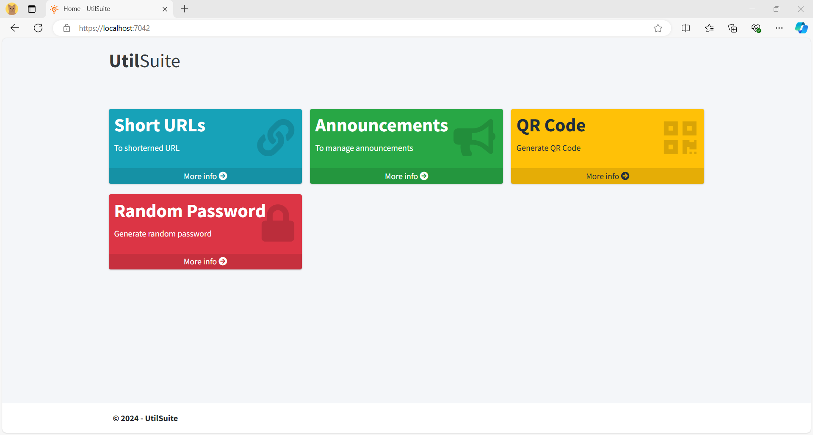
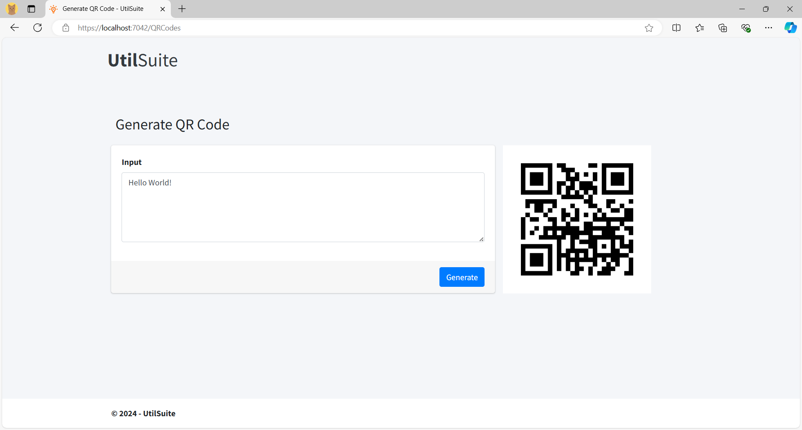
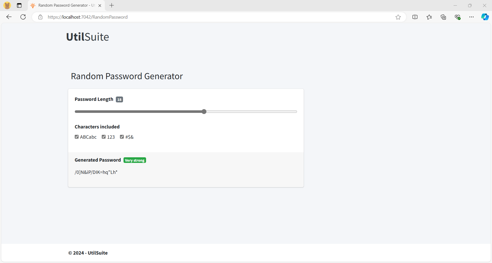
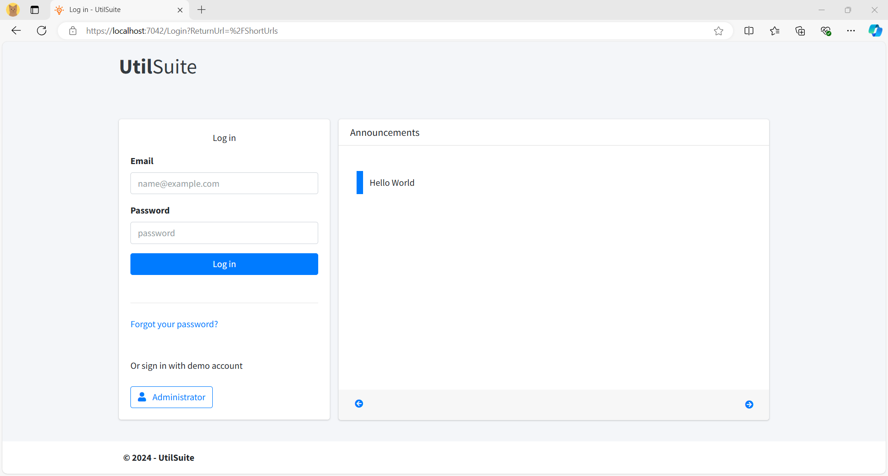
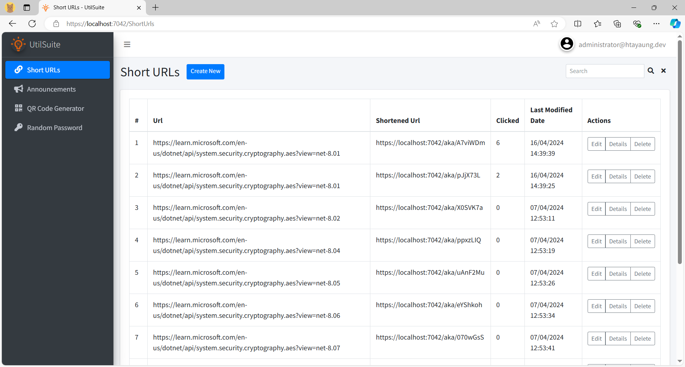
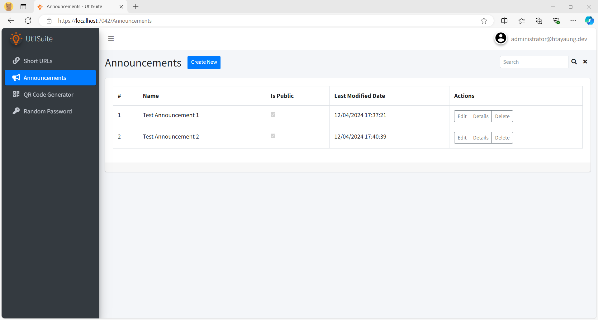

# UtilSuite

Welcome to UtilSuite, a versatile .NET web application designed to streamline various utilities for everyday use. This project features several tools that enhance productivity and user experience, including Short URLs, Announcements, a QR Code Generator, and a Random Password Generator.

## Features

* **Short URLs**: Easily create shortened links for sharing, with tracking capabilities.
* **Announcements**: Post and manage announcements for your users or team.
* **QR Code Generator**: Generate QR codes for URLs, text, or other data quickly and efficiently.
* **Random Password Generator**: Generate secure, random passwords to enhance security.

## Architecture
UtilSuite employs the CQRS (Command Query Responsibility Segregation) pattern, allowing for a clear separation between reading and writing operations. This promotes better scalability and maintainability of the application.

## CRUD Operations
UtilSuite supports full CRUD (Create, Read, Update, Delete) operations for all features.

## Technologies Used
* C#
* .NET 7
* Entity Framework Core
* SQL Express
* [AdminLTE template](https://adminlte.io/)
* [Summernote (WYSIWYG Editor)](https://summernote.org/)

## Screenshots

 

  
  
  
  
  
    

